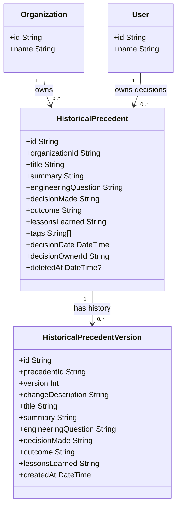

# Historical Precedent Subsystem Architecture

This document describes the technical architecture, data model, similarity matching algorithm, and integration workflow for the **Historical Precedent (Organizational Memory)** subsystem within the Morningstar Solution.

---

## 1. Overview & Product Philosophy

The Historical Precedent capability is not a standalone search index. It is fully integrated into the core engineering verification workflow. Every decision made today is captured to become a reference tomorrow.

When an engineer reviews compliance verification data (suppliers, requirements, standards, etc.), Morningstar automatically scans past records and highlights contextually relevant precedents, providing:

- Deterministic weighted similarity matching.
- Traceability back to historic version states and system audit logs.
- Automatic precedent archival upon engineer sign-off.
- Multi-tenant isolation at the database query boundary.

---

## 2. Data Model

The data model is defined in the database schema (`prisma/schema.prisma`) and mapped to application types.

### Table Schema Definition

1. **`HistoricalPrecedent`**: Holds the current master record for a precedent.
2. **`HistoricalPrecedentVersion`**: Maintains immutable historical states. Any update to a precedent triggers an automatic version bump ($V_{current} + 1$) and records the modifications.
3. **`HistoricalPrecedentAuditLog`**: Tracks modification provenance, recording which user performed what action at what time.

---

## 3. Deterministic Similarity Matching Algorithm

To calculate the contextual match score between the active workspace target and historical precedents, the system implements a deterministic, multi-attribute similarity calculation.

The similarity score $S \in [0, 100]$ is computed as:

$$S = \min\left(100, \sum w_i \cdot J(A_{target}, A_{precedent})\right)$$

Where $J(A, B)$ is the Jaccard similarity index for set-based attributes (or a binary match for exact matches), and $w_i$ are the relative weights assigned to different matching parameters:

| Attribute Criteria        | Weight ($w_i$) | Description                                                       |
| :------------------------ | :------------- | :---------------------------------------------------------------- |
| **Shared Suppliers**      | $25\%$         | Measures similarity in supply chain components                    |
| **Shared Components**     | $25\%$         | Matches physical components/systems under review                  |
| **Shared Standards**      | $20\%$         | Evaluates common regulatory compliance bounds (e.g. ISO, DO-178C) |
| **Shared Requirements**   | $15\%$         | Matches overlapping validation requirements                       |
| **Shared Certifications** | $15\%$         | Flags identical qualification goals                               |
| **Shared Documents**      | $10\%$         | Overlaps in referenced specifications/test logs                   |
| **Shared Contradictions** | $15\%$         | Matches historical issues/failures with current conflicts         |
| **Text Query Overlap**    | Up to $30\%$   | $+10\%$ per keyword overlap from search query (capped at $30\%$)  |

### Rationalization & Match Explanations

Each similarity calculation returns a list of human-readable match explanations (e.g., `Shared supplier connection: Alpha Labs` or `Governed by same engineering standards: DO-178C`). These are displayed directly in the dashboard timeline card.

---

## 4. Workflows

### 4.1 Automated Archival on Sign-off

When an engineer enters a final decision statement and mitigation notes, and clicks **Sign Off & Finalize Decision**:

1. The decision status transitions to `FINALIZED`.
2. A new `HistoricalPrecedent` record is automatically populated from the decision:
   - `Title` is mapped to the final decision text.
   - `DecisionMade` is populated with the decision statement.
   - `LessonsLearned` is populated from the mitigation and rationale notes.
   - `Outcome` is set based on the compliance rating (e.g. `RESOLVED` / `MITIGATED`).
3. An audit log is written, and version 1 is created.

### 4.2 Workspace UI Sidebar Overlay

1. The dashboard fetches similarity matches dynamically on target load.
2. Clicking a precedent card opens the detailed sliding drawer overlay modal.
3. The drawer displays version histories, audit logs, raw parameters (suppliers, requirements, documents), and similarity metrics without disrupting the active work state.

---

## 5. Verification & Quality Assurance

- **Unit Tests**: Executed via Vitest (`tests/unit/precedents/precedent-service.test.ts`) validating CRUD operations, version history increments, and Jaccard-weighted similarity score bounds.
- **Linting**: Enforced with ESLint ensuring zero type warnings and complete React-compliant entity escapes.
